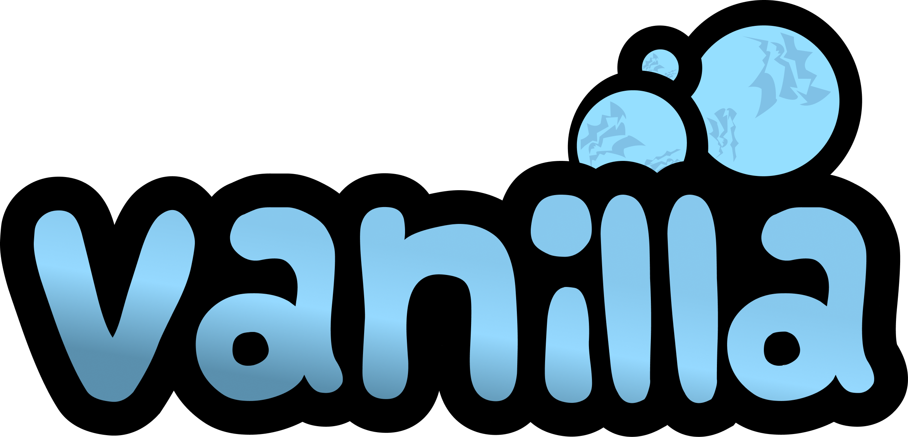

<div align="center">
   
   <h4>A launcher for an old brick-building game.</h4>
   <p>
      
      
      
      
      <a href="https://github.com/frickinfire/VanillaLauncher/blob/main/LICENSE"></a>
   </p>
</div>

## Table of Contents
* [Download](#download)
* [Clients](#clients)

## Download
[](https://github.com/frickinfire/VanillaLauncher/releases/)

```
Disclaimer:
This program is provided for educational and research purposes only.
The creator of this program does not condone or support any illegal or malicious activity, and will not be held responsible for any such actions taken by others who may use this program.
By downloading or using this program, you acknowledge that you are solely responsible for any consequences that may result from the use of this program.
```

## Clients
```
• Early 2007
• Late 2007
• Early 2008
• Mid 2008
• Late 2008
• Mid 2009
• Late 2009
• Mid 2010
• Late 2010
• Early 2011
• Mid 2011
• Mid 2012
• Late 2012
• Mid 2013
• Late 2013
• Mid 2014
• Late 2014
• Early 2015
• Mid 2015
• Early 2016
• Early 2017
• Mid 2018
• Late 2019
• Early 2020
• Early 2021
```

Download clients from our [Discord server](https://discord.com/invite/cE23bqYdbM).

## License
This project is licensed under [GPL v3 license](LICENSE).
